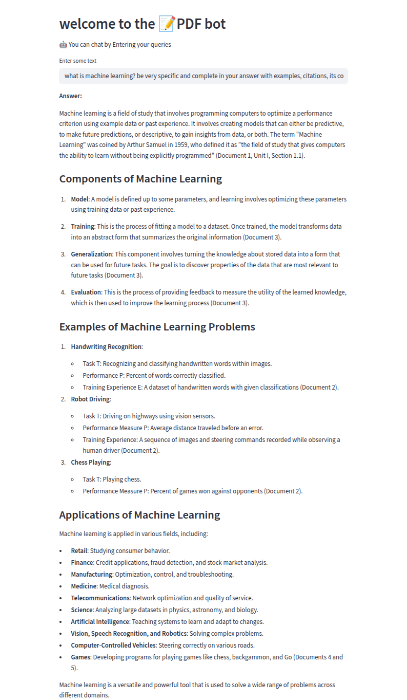
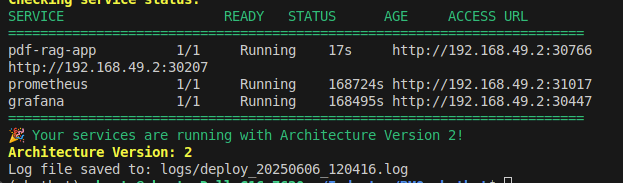
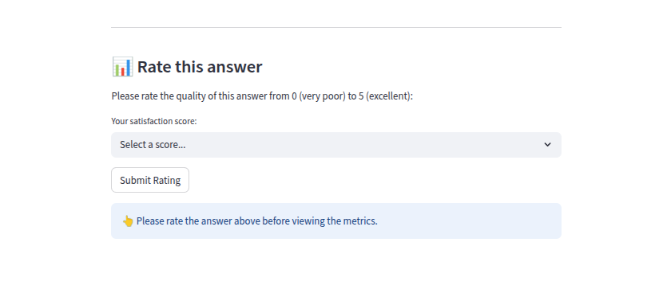
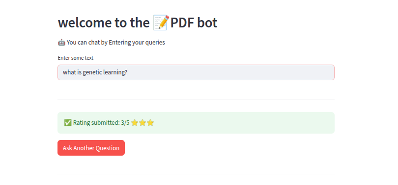
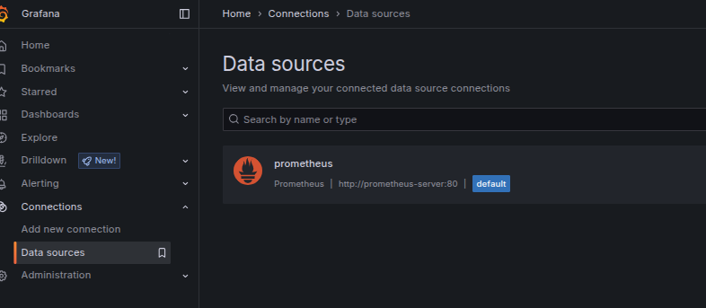
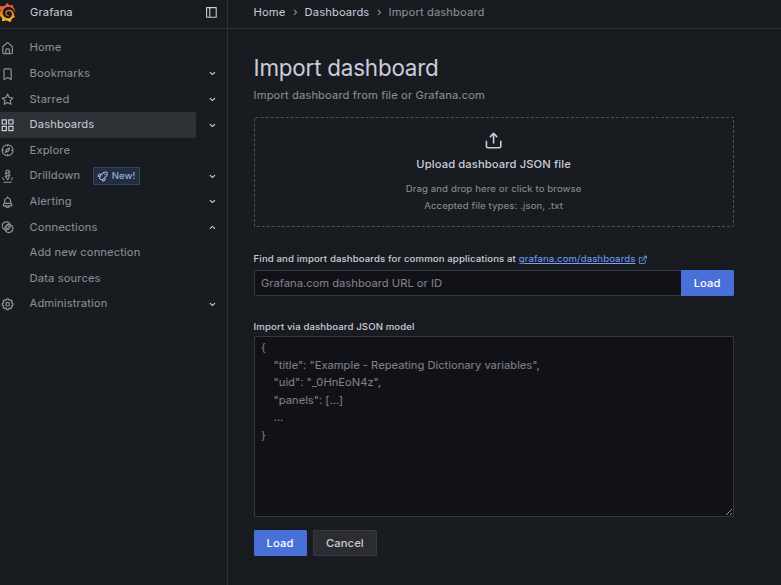
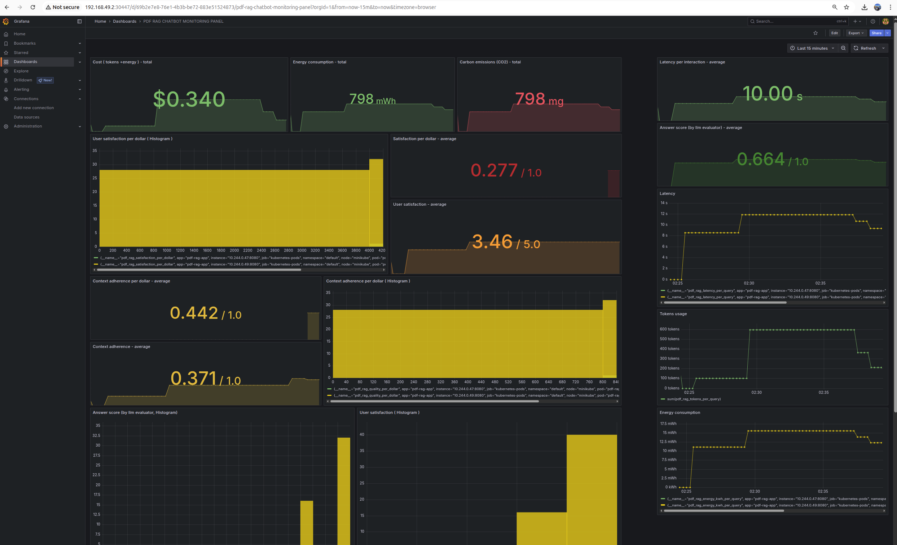

# BMO Chatbot: RAG-Enhanced AI Assistant

This repository contains a prototype for a production-ready chatbot implementation with RAG (Retrieval-Augmented Generation) capabilities. The chatbot leverages advanced AI techniques for enhanced conversational experiences and includes comprehensive deployment, monitoring, and optimization features.



## Author
- Juan David Vargas Mazuera (Université de Montréal, MILA - Quebec AI Institute, CHU Sainte-Justine Research Center)

## Overview

The Chatbot combines state-of-the-art language models with agentic retrieval-augmented generation to provide accurate, contextual responses. The system is designed for production deployment with enterprise-grade monitoring and performance optimization capabilities. 

### Key Features

- **RAG Architecture**: Langgraph implementation of agentic retrieval-augmented generation  
- **Containerized Deployment**: Docker and Kubernetes support for scalable deployment
- **Comprehensive Monitoring**: Prometheus and Grafana integration for real-time metrics
- **Cache memory usage**: Usage of cache memory prevents repeated expensive operations that would otherwise happen on every streamlit rerun
- **Performance Optimized**: Base code provided for finetuning using reinforcement learning from human feedback
- **LLM evaluator**: Alternative deployment of model integrating an llm evaluator to score the relevancy of the response based on the query (Version 2)
- **Context memory**: Alternative deployment of model integrating both an llm evaluator and temporal memory to remember previous interactions (Version 3)


## Basic Installation (Linux code provided)

BMO_chatbot/
├── Core Application Files
│   ├── 📄 chatbot.py
│   ├── 📄 helper_functions.py
│   └── 📄 Langgraph_Agent.py
├── Deployment & Setup
│   ├── 🔧 setup.sh
│   ├── 🚀 deploy.sh                  # Kubernetes deployment script
│   │   ├── 🐳 Dockerfile             # Container image definition
│   │   ├── ⚙️ deployment.yaml        # Kubernetes service manifests
│   │   └── 🔐 secrets.yaml           # Kubernetes secrets configuration
│   └── 📋 requirements.txt
└── 📊 monitoring/
    ├── deployment.yaml
    └── grafana-dashboard.json


### Prerequisites

- Docker 
- Kubernetes cluster (Minikube for local development)
- Helm 
- Prometheus and Grafana


Docker [follow installation steps](https://minikube.sigs.k8s.io/docs/start/?arch=%2Fmacos%2Farm64%2Fstable%2Fhomebrew#Service)

```bash
#Set up Docker's apt repository.
# Add Docker's official GPG key:
sudo apt-get update
sudo apt-get install ca-certificates curl
sudo install -m 0755 -d /etc/apt/keyrings
sudo curl -fsSL https://download.docker.com/linux/ubuntu/gpg -o /etc/apt/keyrings/docker.asc
sudo chmod a+r /etc/apt/keyrings/docker.asc
# Add the repository to Apt sources:
echo "deb [arch=$(dpkg --print-architecture) signed-by=/etc/apt/keyrings/docker.asc] https://download.docker.com/linux/ubuntu \
  $(. /etc/os-release && echo "${UBUNTU_CODENAME:-$VERSION_CODENAME}") stable" | \ sudo tee /etc/apt/sources.list.d/docker.list > /dev/null
sudo apt-get update
# Install the Docker packages.
sudo apt-get install docker-ce docker-ce-cli containerd.io docker-buildx-plugin docker-compose-plugin
# Verify that the installation is successful by running the hello-world image:
sudo usermod -aG docker $USER
newgrp docker
sudo docker run hello-world
```


Minikube [follow installation steps](https://minikube.sigs.k8s.io/docs/start/?arch=%2Fmacos%2Farm64%2Fstable%2Fhomebrew#Service)

```bash
curl -LO https://github.com/kubernetes/minikube/releases/latest/download/minikube-linux-amd64
sudo install minikube-linux-amd64 /usr/local/bin/minikube && rm minikube-linux-amd64
minikube start
```


Helm, Prometheus, and Grafana [follow installation steps](https://blog.marcnuri.com/prometheus-grafana-setup-minikube)


```bash
#install helm, this is pre requiesite for both prometheus and grafana
sudo snap install helm --classic
```

```bash
#installation steps for prometheus
# read more in https://blog.marcnuri.com/prometheus-grafana-setup-minikube
helm repo add prometheus-community https://prometheus-community.github.io/helm-charts
helm install prometheus prometheus-community/prometheus
kubectl expose service prometheus-server --type=NodePort --target-port=9090 --name=prometheus-server-np
kubectl get pods -l app.kubernetes.io/instance=prometheus # (optional) check whether everything has been deployed
minikube service prometheus-server-np # to open prometheus web interface

```

```bash
#installation steps for grafana
helm repo add grafana https://grafana.github.io/helm-charts
helm install grafana grafana/grafana
kubectl expose service grafana --type=NodePort --target-port=3000 --name=grafana-np
kubectl get secret --namespace default grafana -o jsonpath="{.data.admin-password}" | base64 --decode ; echo #get grafana admin password
```

Follow the instructions in the command, save the credentials, and enter Grafana's interface using the key from the previous step:

```bash
minikube service grafana-np #load grafana web interface using credentials
# user = admin
# password = output from previous command
```

## Deployment


### Clone the repository

```bash
git clone https://github.com/juandavidvargas19/BMO_chatbot.git -b Production
```

### Set-up open-ai keys 

Go to your open-ai account and copy your open-ai key. Make sure you have balance in your account. [open-ai keys](https://platform.openai.com/api-keys)

Then, execute and following code. Use the output as the opena-ai key in the secrets.yaml file.

```bash
echo -n 'sk-your-actual-api-key' | base64
```

### Run both the set-up script, and the deployment script

set-up
```bash
chmod a+x setup.sh
./setup.sh
```

For the deployment, there are 3 versions available that can be deployed depending on the specific needs of the client.

These versions are:
1. **Base model**: Agentic RAG (Version 1)


2. **Base model + LLM evaluator**: Alternative deployment of model integrating an llm evaluator to score the relevancy of the response based on the query (Version 2)


3. **Base model + LLM evaluator + context memory**: Alternative deployment of model integrating both an llm evaluator and temporal memory to remember previous interactions (Version 3)

To deploy each, you need to run the deployment script as in the example:
```bash
chmod a+x deploy.sh
./deploy.sh 1 #version 1
# ./deploy.sh 2  #version 2
# ./deploy.sh 3 #version 3
```

### Open the interface

Use the URL address to open the graphical interface of the chatbot. 



Rate each answer to proceed



Click the "Ask Another Question" there after.



## Monitoring

To succesfully set up your monitoring pipeline you need to follow 4 steps:

1. Enter the Grafana Graphical interface using the URL address displayed


2. Add prometheus as a data source


3. Import the json file [json file](Monitoring_Template/PDF RAG CHATBOT MONITORING PANEL-1749235089674.json)


4. Enjoy


## Optimization

To leverage the potential of agentic RAG, we implement a pipeline to finetune the main llm using reinforcement learning from human feedback. 

Our target score is the average of 2 metrics: (normalized user score per dollar, normalized context adherence per dollar). This results in a score in the range [0.00 , 1.00]. In the pipeline, we find a reward model using these metrics, to then finetune our llm. The result is model id which we can change in "Langgraph_Agent.py" file.  The result will look like this:

```bash
{
  "model_id": "ft:gpt-4o-2024-08-06:personal::Bew7X3c0",
  "job_id": "ftjob-d6IPhvlakLgoW9Z0i6czxsTv",
  "created_at": "2025-06-04T23:04:21.227879",
  "training_file": "fine_tuning_data_20250604_225715.jsonl",
  "base_model": "gpt-4o-2024-08-06"
}
```

To run this pipeline, you need to collect a big sample of interactions with the chatbot. At every interaction, the necesary inputs will be saved in a "training_data.jsonl" file. We will copy this file to the RLHF directory, and then run the script to finetune our llm.

```bash
cp training_data.jsonl RLHF
python RLHF.py
```

## Production plans

To refer to our full production plans, as well as answers to relevant question about the implementation of this chatbot, please open the plannification file referenced.


## Citation

If you want to use this code, please reach out to BMO capital markets.


